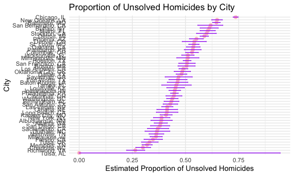

p8105_hw5_coo2124
================
Christiana Odewumi

# Load necessary libraries

``` r
library(tidyverse)    
```

    ## ── Attaching core tidyverse packages ──────────────────────── tidyverse 2.0.0 ──
    ## ✔ dplyr     1.1.4     ✔ readr     2.1.5
    ## ✔ forcats   1.0.0     ✔ stringr   1.5.1
    ## ✔ ggplot2   3.5.1     ✔ tibble    3.2.1
    ## ✔ lubridate 1.9.3     ✔ tidyr     1.3.1
    ## ✔ purrr     1.0.2     
    ## ── Conflicts ────────────────────────────────────────── tidyverse_conflicts() ──
    ## ✖ dplyr::filter() masks stats::filter()
    ## ✖ dplyr::lag()    masks stats::lag()
    ## ℹ Use the conflicted package (<http://conflicted.r-lib.org/>) to force all conflicts to become errors

``` r
library(broom)        
library(purrr)
library(rvest)
```

    ## 
    ## Attaching package: 'rvest'
    ## 
    ## The following object is masked from 'package:readr':
    ## 
    ##     guess_encoding

``` r
set.seed(1)

knitr::opts_chunk$set(
        echo = TRUE,
        warning = FALSE,
        fig.width = 6,
        fig.asp = .6,
        out.width = "90%"
)

theme_set (theme_minimal() + theme(legend.position = "bottom"))

options(
  ggplot2.continuous.colour = "viridis",
  ggplot2.continuous.fill = "viridis"
)

scale_colour_discrete = scale_colour_viridis_d
scale_fill_discrete = scale_fill_viridis_d
```

## problem 1

Function to simulate birthdays and checks whether there are duplicate
birthdays in the group

``` r
simulate_shared_birthday = function(n) {
  birthdays = sample(1:365, n, replace = TRUE)
  has_duplicate = any(duplicated(birthdays))
}
```

Run this function 10,000 times for each group size between 2 and 50.

``` r
compute_duplicate_probability <- function(n) {
  simulations <- map_lgl(1:10000, ~simulate_shared_birthday(n))
  prob <- mean(simulations)
  
  tibble(
    group_size = n,
    prob_duplicate = prob
  )
}

result_final <- map_dfr(2:50, compute_duplicate_probability)
result_final
```

    ## # A tibble: 49 × 2
    ##    group_size prob_duplicate
    ##         <int>          <dbl>
    ##  1          2         0.0024
    ##  2          3         0.0085
    ##  3          4         0.0167
    ##  4          5         0.0267
    ##  5          6         0.0399
    ##  6          7         0.0521
    ##  7          8         0.0751
    ##  8          9         0.0925
    ##  9         10         0.116 
    ## 10         11         0.139 
    ## # ℹ 39 more rows

Make a plot showing the probability as a function of group size, and
comment on your results.

``` r
ggplot(result_final, aes(x = group_size, y = prob_duplicate)) +
  geom_line() +
  geom_point() +
  labs(
    title = "Probability of People Sharing a Birthday",
    x = "Group Size",
    y = "Probability"
  ) +
  theme_minimal()
```


comment As the group size (n) increases, the probability of at least two
people sharing a birthday rises rapidly, surpassing 50% with just 23
people. By a group of 50, the probability is nearly 100%, making a
shared birthday almost certain. The plot highlights a nonlinear
relationship, with a sharp increase for smaller groups that gradually
levels off as the probability approaches 1, showing diminishing returns
beyond 30 people.

## problem 2

``` r
simulate_t_test <- function(mu, n = 30, sigma = 5) {
  data <- rnorm(n, mean = mu, sd = sigma)
  
  t_test_result <- t.test(data, mu = 0) %>% 
    broom::tidy()
  
  tibble(
    mu_hat = t_test_result$estimate,
    p_value = t_test_result$p.value
  )
}

simulate_for_mu = function(mu, n = 30, sigma = 5, simulations = 5000) {
  results = map_dfr(1:simulations, ~ simulate_t_test(mu, n, sigma))
  
  power = mean(results$p_value < 0.05)
  avg_mu = mean(results$mu_hat)
  avg_mu_rejected = mean(results$mu_hat[results$p_value < 0.05], na.rm = TRUE)
  
  tibble(
    true_mu = mu,
    power = power,
    avg_mu = avg_mu,
    avg_mu_rejected = avg_mu_rejected
  )
}

mu_values = c(1,2,3,4,5,6)
simulation_results <- map_dfr(mu_values, simulate_for_mu)

simulation_results
```

    ## # A tibble: 6 × 4
    ##   true_mu power avg_mu avg_mu_rejected
    ##     <dbl> <dbl>  <dbl>           <dbl>
    ## 1       1 0.186   1.00            2.27
    ## 2       2 0.558   1.99            2.62
    ## 3       3 0.890   3.01            3.19
    ## 4       4 0.989   4.01            4.04
    ## 5       5 1.00    5.01            5.01
    ## 6       6 1       6.01            6.01

``` r
ggplot(simulation_results, aes(x = true_mu, y = power)) +
  geom_line(color = "pink") +
  geom_point(color = "purple") +
  labs(
    title = "Power of the Test vs. True Mu",
    x = "True Value of Mu",
    y = "Power"
  ) +
  theme_minimal()
```


comments The plot shows that as the true value of mu increases, the
power of the test rises sharply. For smaller mu, the power is low, but
it quickly approaches 1 for larger mu, indicating a higher likelihood of
correctly rejecting the null hypothesis as the effect size grows.

``` r
ggplot(simulation_results, aes(x = true_mu)) +
  geom_line(aes(y = avg_mu), color = "green", linetype = "solid", size = 1) +
  geom_line(aes(y = avg_mu_rejected), color = "orange", linetype = "solid", size = 1) +
  geom_point(aes(y = avg_mu), color = "green") +
  geom_point(aes(y = avg_mu_rejected), color = "orange") +
  labs(
    title = "Average Estimate of Mu vs. True Mu",
    x = "True Value of Mu",
    y = "Average Estimate"
  ) +
  theme_minimal()
```


comments The sample average of 𝜇̂ across tests where the null hypothesis
was rejected is not approximately equal to the true value of𝜇. This is
due to selection bias: tests that reject the null (p\<0.05) are more
likely to come from samples where 𝜇̂deviates significantly from 0,
leading to inflated estimates. This is evident in the plot, where the
orange line representing the average of 𝜇̂for rejected samples
consistently lies above the true value of𝜇In contrast, the green line,
which shows the overall average of 𝜇̂ across all samples, aligns closely
with the true value, demonstrating that the estimation process is
unbiased when considering all data. Thus, focusing only on rejected
samples results in biased, upwardly skewed estimates that do not
accurately reflect the true mean.

## problem 3

Load data from the GitHub repository (replace with the actual URL of the
dataset)

``` r
homicide_data <- read_csv("https://raw.githubusercontent.com/washingtonpost/data-homicides/master/homicide-data.csv")
```

    ## Rows: 52179 Columns: 12
    ## ── Column specification ────────────────────────────────────────────────────────
    ## Delimiter: ","
    ## chr (9): uid, victim_last, victim_first, victim_race, victim_age, victim_sex...
    ## dbl (3): reported_date, lat, lon
    ## 
    ## ℹ Use `spec()` to retrieve the full column specification for this data.
    ## ℹ Specify the column types or set `show_col_types = FALSE` to quiet this message.

``` r
str(homicide_data)
```

    ## spc_tbl_ [52,179 × 12] (S3: spec_tbl_df/tbl_df/tbl/data.frame)
    ##  $ uid          : chr [1:52179] "Alb-000001" "Alb-000002" "Alb-000003" "Alb-000004" ...
    ##  $ reported_date: num [1:52179] 20100504 20100216 20100601 20100101 20100102 ...
    ##  $ victim_last  : chr [1:52179] "GARCIA" "MONTOYA" "SATTERFIELD" "MENDIOLA" ...
    ##  $ victim_first : chr [1:52179] "JUAN" "CAMERON" "VIVIANA" "CARLOS" ...
    ##  $ victim_race  : chr [1:52179] "Hispanic" "Hispanic" "White" "Hispanic" ...
    ##  $ victim_age   : chr [1:52179] "78" "17" "15" "32" ...
    ##  $ victim_sex   : chr [1:52179] "Male" "Male" "Female" "Male" ...
    ##  $ city         : chr [1:52179] "Albuquerque" "Albuquerque" "Albuquerque" "Albuquerque" ...
    ##  $ state        : chr [1:52179] "NM" "NM" "NM" "NM" ...
    ##  $ lat          : num [1:52179] 35.1 35.1 35.1 35.1 35.1 ...
    ##  $ lon          : num [1:52179] -107 -107 -107 -107 -107 ...
    ##  $ disposition  : chr [1:52179] "Closed without arrest" "Closed by arrest" "Closed without arrest" "Closed by arrest" ...
    ##  - attr(*, "spec")=
    ##   .. cols(
    ##   ..   uid = col_character(),
    ##   ..   reported_date = col_double(),
    ##   ..   victim_last = col_character(),
    ##   ..   victim_first = col_character(),
    ##   ..   victim_race = col_character(),
    ##   ..   victim_age = col_character(),
    ##   ..   victim_sex = col_character(),
    ##   ..   city = col_character(),
    ##   ..   state = col_character(),
    ##   ..   lat = col_double(),
    ##   ..   lon = col_double(),
    ##   ..   disposition = col_character()
    ##   .. )
    ##  - attr(*, "problems")=<externalptr>

comments

The raw dataset contains 52,179 rows and 12 columns, with each row
representing a unique homicide case from 50 large U.S. cities. The
dataset includes demographic details about the victims, such as their
first and last names (victim_first, victim_last), race (victim_race),
age (victim_age), and sex (victim_sex). Geographic information is
provided through the city and state where the homicide occurred (city,
state), as well as latitude and longitude (lat, lon) for mapping
purposes. The date the homicide was reported is recorded in the
reported_date column, and each case is uniquely identified by the uid
column. The disposition column indicates the status of each case,
distinguishing between solved cases (e.g., “Closed by arrest”) and
unsolved cases (e.g., “Open/No arrest”). This dataset provides a
comprehensive view of homicide cases, enabling detailed analysis of
trends, victim demographics, and case outcomes across major U.S. cities.
Some columns, such as victim_age and geographic coordinates, may contain
missing values, which should be accounted for in the analysis.

Create city_state variable and summarize homicides

``` r
homicide_summary = homicide_data %>%
  mutate(city_state = paste(city, state, sep = ", ")) %>%
  group_by(city_state) %>%
  summarize(
    total_homicides = n(),
    unsolved_homicides = sum(disposition %in% c("Closed without arrest", "Open/No arrest"))
  ) %>%
  ungroup()


homicide_summary
```

    ## # A tibble: 51 × 3
    ##    city_state      total_homicides unsolved_homicides
    ##    <chr>                     <int>              <int>
    ##  1 Albuquerque, NM             378                146
    ##  2 Atlanta, GA                 973                373
    ##  3 Baltimore, MD              2827               1825
    ##  4 Baton Rouge, LA             424                196
    ##  5 Birmingham, AL              800                347
    ##  6 Boston, MA                  614                310
    ##  7 Buffalo, NY                 521                319
    ##  8 Charlotte, NC               687                206
    ##  9 Chicago, IL                5535               4073
    ## 10 Cincinnati, OH              694                309
    ## # ℹ 41 more rows

``` r
baltimore_data = homicide_summary %>% filter(city_state == "Baltimore, MD")
baltimore_test = prop.test(
  baltimore_data$unsolved_homicides,
  baltimore_data$total_homicides
)

baltimore_result = broom::tidy(baltimore_test) %>%
  select(estimate, conf.low, conf.high)

baltimore_result
```

    ## # A tibble: 1 × 3
    ##   estimate conf.low conf.high
    ##      <dbl>    <dbl>     <dbl>
    ## 1    0.646    0.628     0.663

``` r
city_results = homicide_summary %>%
  mutate(
    prop_test = map2(
      unsolved_homicides,
      total_homicides,
      ~ prop.test(.x, .y) %>% broom::tidy()
    )
  ) %>%
  unnest(prop_test) %>%
  select(city_state, estimate, conf.low, conf.high)

city_results
```

    ## # A tibble: 51 × 4
    ##    city_state      estimate conf.low conf.high
    ##    <chr>              <dbl>    <dbl>     <dbl>
    ##  1 Albuquerque, NM    0.386    0.337     0.438
    ##  2 Atlanta, GA        0.383    0.353     0.415
    ##  3 Baltimore, MD      0.646    0.628     0.663
    ##  4 Baton Rouge, LA    0.462    0.414     0.511
    ##  5 Birmingham, AL     0.434    0.399     0.469
    ##  6 Boston, MA         0.505    0.465     0.545
    ##  7 Buffalo, NY        0.612    0.569     0.654
    ##  8 Charlotte, NC      0.300    0.266     0.336
    ##  9 Chicago, IL        0.736    0.724     0.747
    ## 10 Cincinnati, OH     0.445    0.408     0.483
    ## # ℹ 41 more rows

Now run prop.test for each of the cities in your dataset, and extract
both the proportion of unsolved homicides and the confidence interval
for each.

``` r
city_results = homicide_summary %>%
  mutate(
    prop_test = map2(
      unsolved_homicides,
      total_homicides,
      ~ prop.test(.x, .y) %>% broom::tidy()
    )
  ) %>%
  unnest(prop_test) %>%
  select(city_state, estimate, conf.low, conf.high)

city_results
```

    ## # A tibble: 51 × 4
    ##    city_state      estimate conf.low conf.high
    ##    <chr>              <dbl>    <dbl>     <dbl>
    ##  1 Albuquerque, NM    0.386    0.337     0.438
    ##  2 Atlanta, GA        0.383    0.353     0.415
    ##  3 Baltimore, MD      0.646    0.628     0.663
    ##  4 Baton Rouge, LA    0.462    0.414     0.511
    ##  5 Birmingham, AL     0.434    0.399     0.469
    ##  6 Boston, MA         0.505    0.465     0.545
    ##  7 Buffalo, NY        0.612    0.569     0.654
    ##  8 Charlotte, NC      0.300    0.266     0.336
    ##  9 Chicago, IL        0.736    0.724     0.747
    ## 10 Cincinnati, OH     0.445    0.408     0.483
    ## # ℹ 41 more rows

Create a plot that shows the estimates and CIs for each city – check out
geom_errorbar for a way to add error bars based on the upper and lower
limits.

``` r
ggplot(city_results, aes(x = reorder(city_state, estimate), y = estimate)) +
  geom_point(size = 2, color = "pink") +
  geom_errorbar(aes(ymin = conf.low, ymax = conf.high), width = 0.3, color = "purple") +
  labs(
    title = "Proportion of Unsolved Homicides by City",
    x = "City",
    y = "Estimated Proportion of Unsolved Homicides"
  ) +
  coord_flip() +  
  theme_minimal()
```


